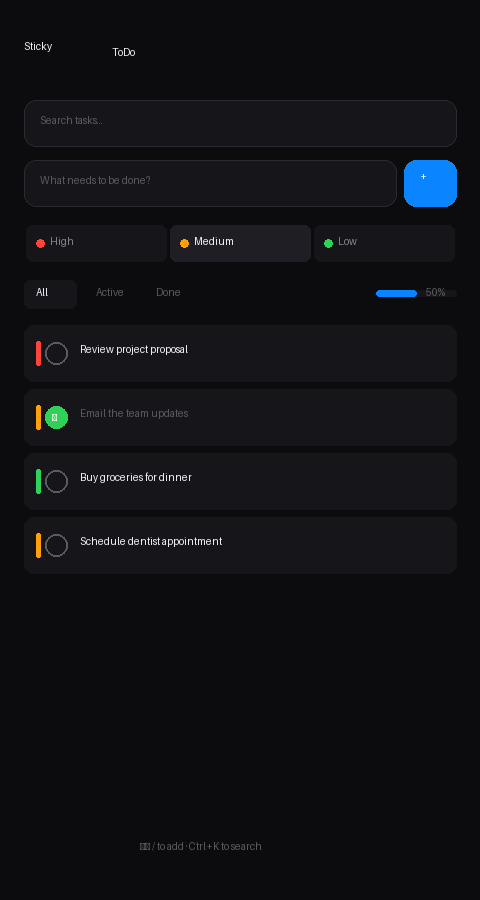
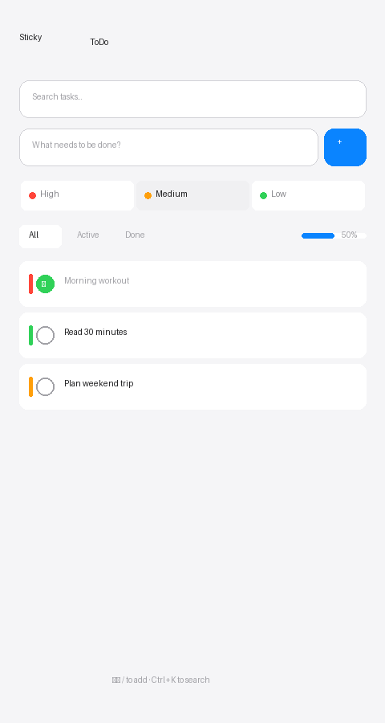
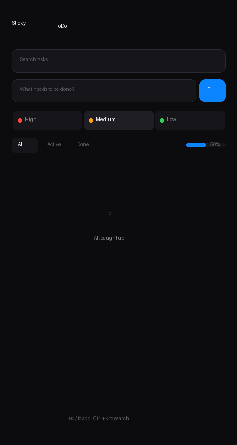
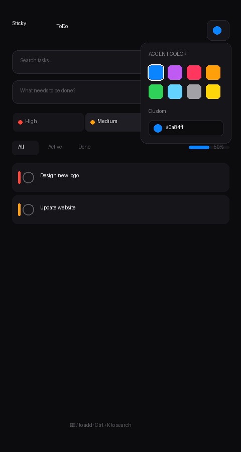

# 📝 Sticky ToDo

[](https://siddharthsuhaspawar.github.io/sticky-todo/)
[](https://github.com/siddharthsuhaspawar/sticky-todo)
[](LICENSE)

**🌐 [Try it now → https://siddharthsuhaspawar.github.io/sticky-todo/](https://siddharthsuhaspawar.github.io/sticky-todo/)**

A minimal, elegant todo application with beautiful typography and intuitive design. Works entirely in your browser — no installation needed!

---

## 📱 Screenshots

<div align="center">

| Dark Mode | Light Mode | Empty State | Customize |
|:---------:|:----------:|:-----------:|:---------:|
|  |  |  |  |
| *Beautiful dark theme* | *Clean light theme* | *Celebratory empty state* | *Customize accent colors* |

</div>

---

## ✨ Features

- **Beautiful Typography** - Elegant serif italic font for the brand with graceful styling
- **Dark & Light Themes** - Toggle between gorgeous dark and light modes
- **Drag & Drop** - Reorder tasks intuitively with smooth animations
- **Persistent Storage** - Tasks and preferences are saved automatically in your browser
- **Keyboard Shortcuts** - Press `/` to focus input, `Ctrl+K` to search, `Esc` to clear
- **Clean UI** - Minimalist design with subtle animations and premium feel
- **PWA Support** - Install as an app on your device

## 🚀 Quick Start

### Web Version (No Installation!)
**👉 [Click here to use Sticky ToDo in your browser](https://siddharthsuhaspawar.github.io/sticky-todo/)**

Or simply open `todo.html` in any modern web browser.

### Install as a Web App (Microsoft Edge)

Turn Sticky ToDo into a desktop app that works offline and launches from your taskbar:

1. **Open** the [live demo](https://siddharthsuhaspawar.github.io/sticky-todo/) in **Microsoft Edge**

2. **Click the install icon** (⊞) in the address bar  
   *or* press `Ctrl+Shift+A`  
   *or* click **Settings (⋯) → Apps → Install this site as an app**

3. **Click "Install"** in the popup dialog

4. **Done!** Sticky ToDo will now:
   - Appear in your Start Menu
   - Have its own taskbar icon
   - Work offline
   - Launch like a native Windows app

💡 **Tip:** You can also right-click the app in your taskbar and select "Pin to taskbar" for quick access!

---

### Mobile: Add to Home Screen

**iPhone/iPad (Safari):**
1. Tap the **Share** button (⬆️)
2. Scroll down and tap **"Add to Home Screen"**
3. Tap **"Add"**

**Android (Chrome/Edge):**
1. Tap the **Menu** (⋯)
2. Tap **"Add to Home screen"** or **"Install app"**
3. Tap **"Install"**

## 📁 Project Structure

```
sticky-todo/
├── todo.html          # Main UI (HTML/CSS/JS) - Complete app in one file
├── README.md          # This file
├── LICENSE            # MIT License
├── .gitignore         # Git ignore rules
├── AGENTS.md          # Agent notes
└── screenshots/       # App screenshots
```

## 🎨 Design Philosophy

Sticky ToDo embraces **less is more**:

- **Typography**: Elegant serif for branding, clean sans-serif for readability
- **Colors**: Carefully crafted dark/light palettes with proper contrast
- **Motion**: Subtle animations that feel responsive and delightful
- **Focus**: No unnecessary features - just a simple, beautiful todo list

## ⌨️ Keyboard Shortcuts

| Shortcut | Action |
|----------|--------|
| `/` | Focus the input field |
| `Ctrl+K` / `Cmd+K` | Open search |
| `Enter` | Add task (when input is focused) |
| `Esc` | Clear input / close search |
| `Space/Enter` | Toggle task completion (when checkbox is focused) |

## 💾 Data Storage

All data is stored locally in your browser using `localStorage`:
- Tasks are saved automatically
- Theme preference is remembered
- Accent color choice is preserved

**Note:** Clearing browser data will remove your tasks. Export/import coming soon!

## 🤝 Contributing

Contributions are welcome! Please feel free to submit a Pull Request.

1. Fork the repository
2. Create your feature branch (`git checkout -b feature/AmazingFeature`)
3. Commit your changes (`git commit -m 'Add some AmazingFeature'`)
4. Push to the branch (`git push origin feature/AmazingFeature`)
5. Open a Pull Request

## 📝 License

This project is licensed under the MIT License - see the [LICENSE](LICENSE) file for details.

---

<p align="center">
  Made with ❤️ for beautiful productivity
</p>
