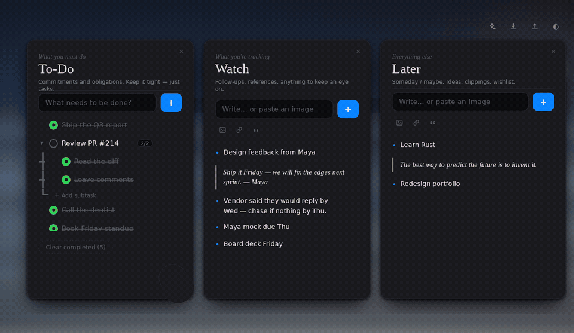
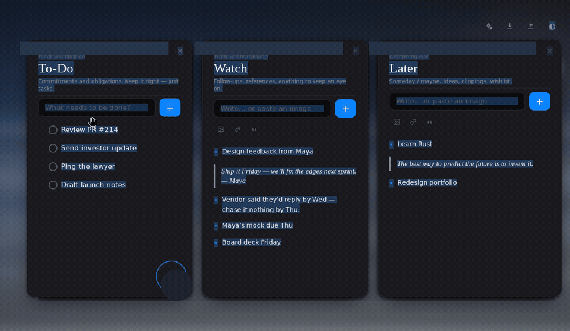
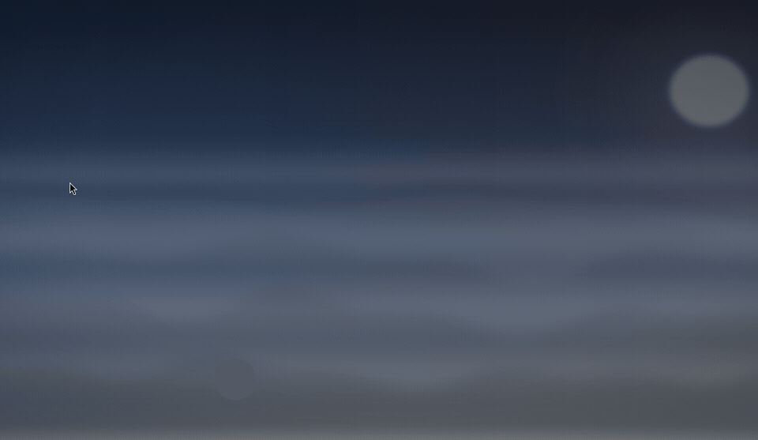
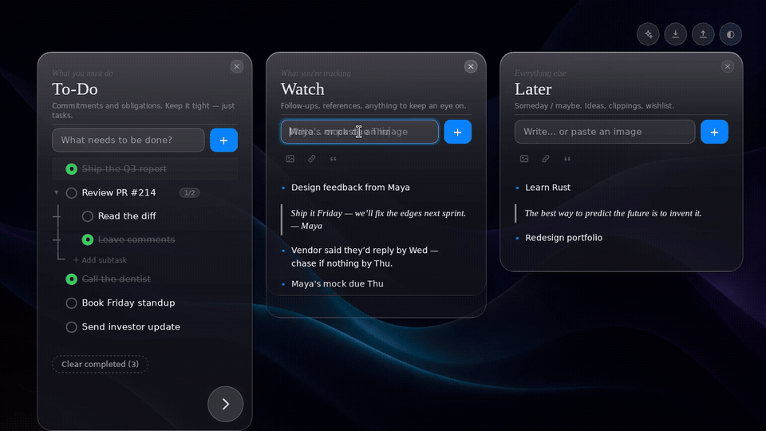

# Three Lists

A Marc Andreessen-style desk: **To-Do**, **Watch**, and **Later**. Keep the first list tight. Park everything else.

**[Open it](https://siddharthsuhaspawar.github.io/sticky-todo/)** · MIT · no backend

## Demo

<p align="center">
  
</p>

| Add a task | Check one off | Focus |
| --- | --- | --- |
|  |  |  |

Short video: [demo.mp4](media/demo.mp4)

## The three lists

| List | For |
| --- | --- |
| **To-Do** | What you must do. Commitments only. |
| **Watch** | What you are tracking. Follow-ups, references. |
| **Later** | Someday / maybe. Ideas, quotes, clippings. |

To-Do is a task list (sub-trees, Enter to chain, Tab to indent, clear completed). Watch and Later take text, images, and quotes.

## Run it

Browser: open `index.html` (or `todo.html`, they are the same file).

Desktop: Tauri app in `src-tauri/`. Build with `build/build_tauri.cmd` on Windows (needs VS C++ build tools and Rust).

Data stays in `localStorage`. Nothing is sent to a server. Import / export JSON if you want a file backup.

## Repo

```
index.html / todo.html   the app
src-tauri/               desktop shell
media/                   demo GIFs and video
screenshots/             stills
LICENSE                  MIT
```

## License

MIT. See [LICENSE](LICENSE).
