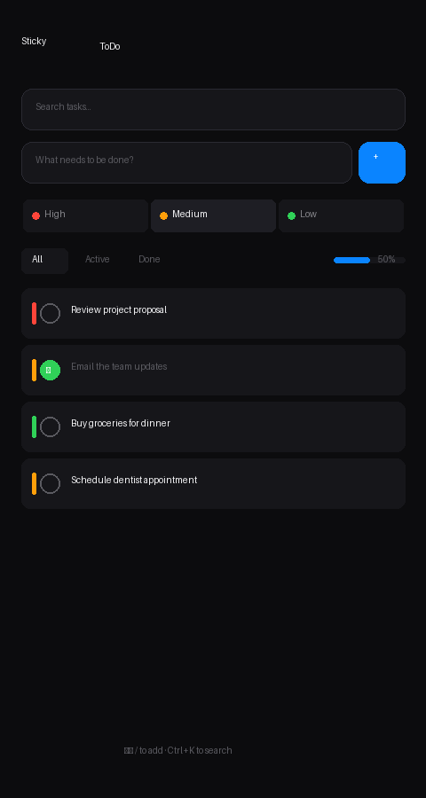
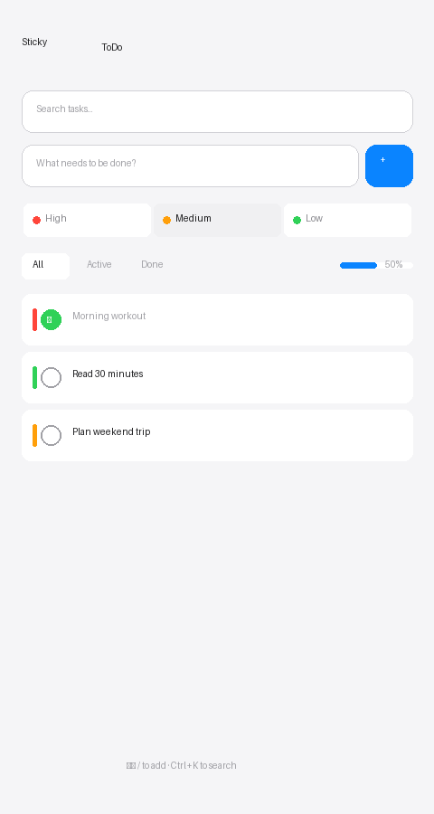
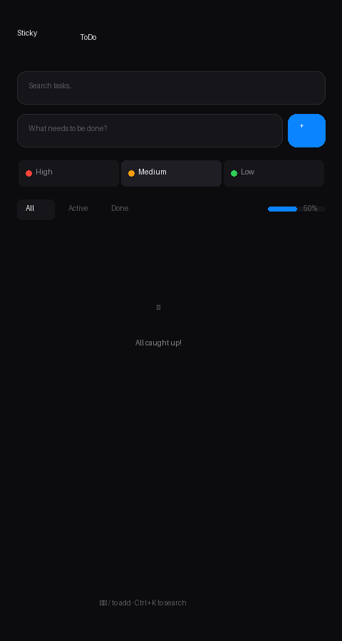
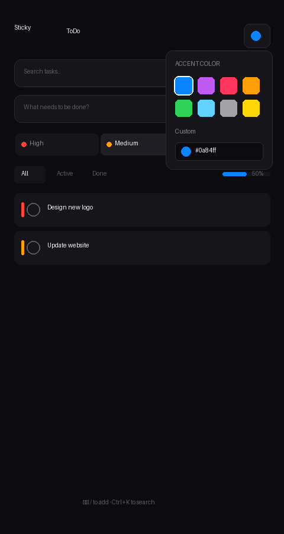

# Sticky ToDo

[](https://siddharthsuhaspawar.github.io/sticky-todo/)
[](todo.html)
[](LICENSE)

> A single-file todo app with subtasks, priorities, and a clean UI. No frameworks, no build tools, no backend — just one HTML file.

**[Try it live →](https://siddharthsuhaspawar.github.io/sticky-todo/)**

---

## Screenshots

<div align="center">
<table>
<tr>
<td align="center"><strong>Dark Mode</strong><br></td>
<td align="center"><strong>Light Mode</strong><br></td>
</tr>
<tr>
<td align="center"><strong>Subtasks</strong><br></td>
<td align="center"><strong>Color Picker</strong><br></td>
</tr>
</table>
</div>

---

## Features

**Core**
- Create, edit, and delete tasks with inline editing
- Subtasks with tree-structure display and progress tracking (`2/3`)
- Press `Enter` in a subtask to save and immediately start the next one
- Drag-and-drop reordering via dedicated handle
- Pin tasks to the top

**Organization**
- Three priority levels (high / medium / low) with color indicators
- Search and filter with `Ctrl+K`
- Bulk actions: mark all done, delete completed

**Customization**
- Dark and light themes
- 8 accent colors
- Responsive — works on desktop and mobile

**Backup**
- Automatic daily snapshots saved as JSON files to a folder you pick
- Uses the File System Access API — works in Chrome/Edge, hidden in unsupported browsers
- Snapshot at 5 PM daily; catches up on next open if missed
- Browse and restore from backup history (🕘 button)
- Auto-cleanup: keeps last 30 days

**Technical**
- Single HTML file (~2400 lines), zero dependencies
- All data in `localStorage` — nothing leaves your browser
- Import/export JSON backup
- Installable as a PWA (works offline)

---

## Quick Start

Open [`todo.html`](todo.html) in any browser. That's it.

Or use the hosted version: **[siddharthsuhaspawar.github.io/sticky-todo](https://siddharthsuhaspawar.github.io/sticky-todo/)**

### Install as a Desktop/Mobile App

| Platform | Steps |
|----------|-------|
| **Chrome** | Visit the live demo → click install icon (⧉) in address bar → Install |
| **Edge** | Visit the live demo → `Ctrl+Shift+A` or ⋯ → Apps → Install |
| **Safari (iOS)** | Share (⬆️) → Add to Home Screen |
| **Chrome (Android)** | Menu (⋯) → Add to Home screen |

Once installed: own window, own icon, works offline.

---

## Keyboard Shortcuts

| Key | Action |
|-----|--------|
| `/` | Focus task input |
| `Enter` | Add task / save subtask and create next |
| `Ctrl+K` | Search |
| `Esc` | Clear input / close search / cancel edit |

---

## Data & Privacy

Everything is stored in your browser's `localStorage`:
- Tasks, subtasks, priorities, pin state
- Theme and accent color preferences

Daily snapshots (if enabled) are saved as local files to a folder you choose — the directory handle is stored in IndexedDB. Nothing is sent to any server.

---

## Project Structure

```
sticky-todo/
├── todo.html      # The entire app — HTML, CSS, and JS in one file
├── README.md
├── LICENSE
└── screenshots/
```

---

## Contributing

PRs welcome. Fork → branch → commit → open a pull request.

## License

MIT — see [LICENSE](LICENSE).
